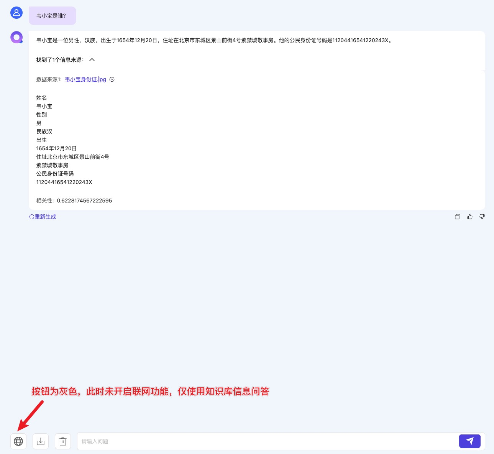
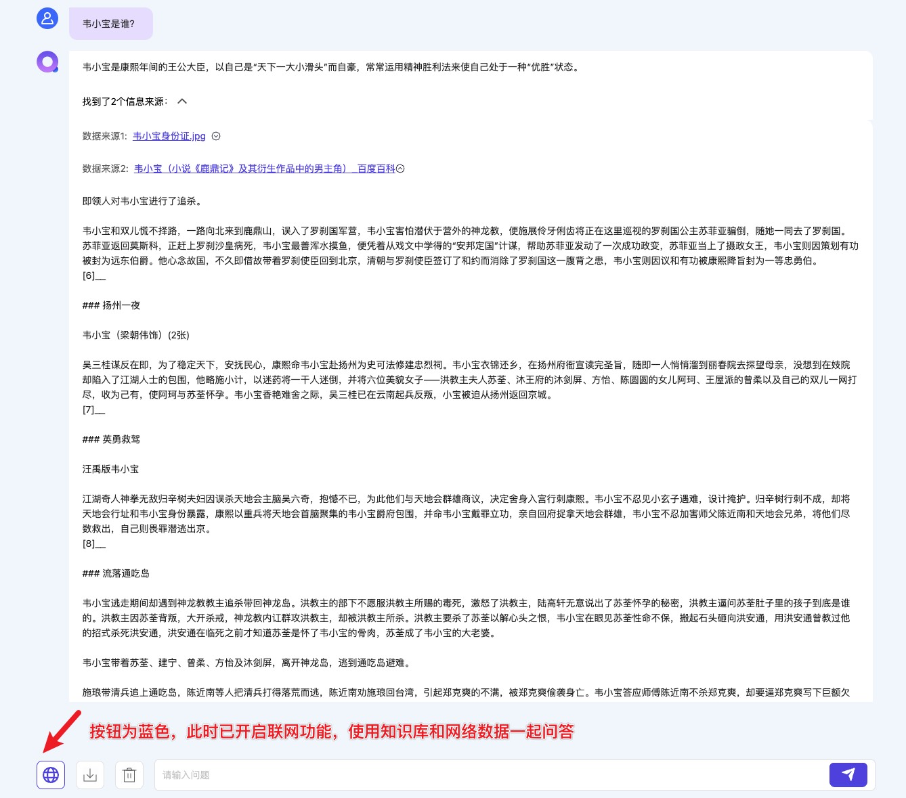
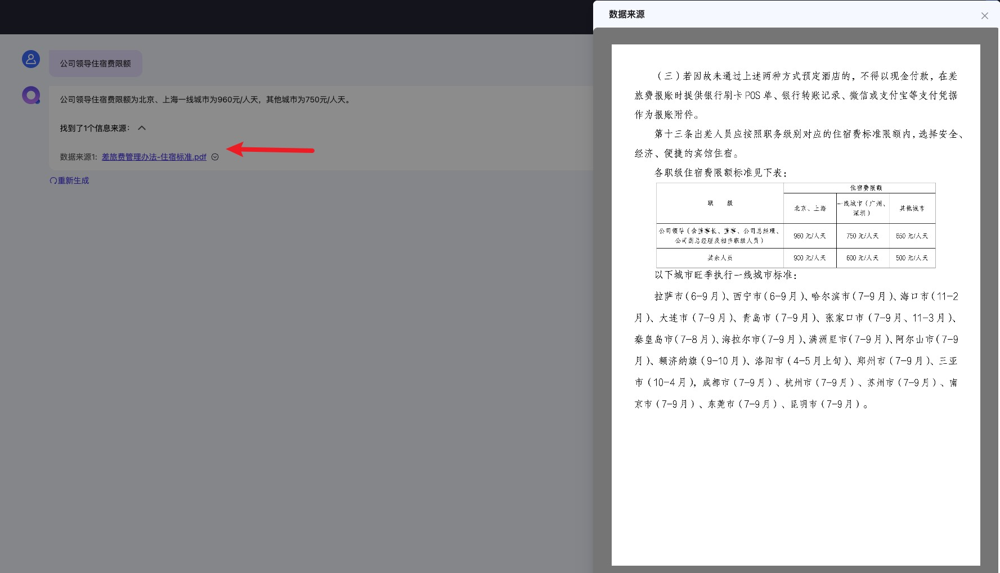
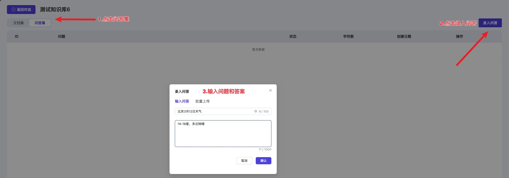
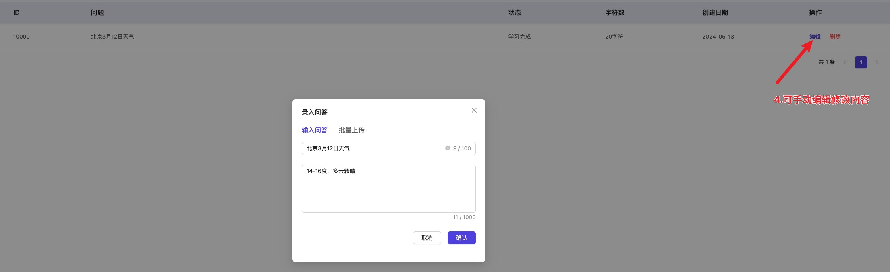
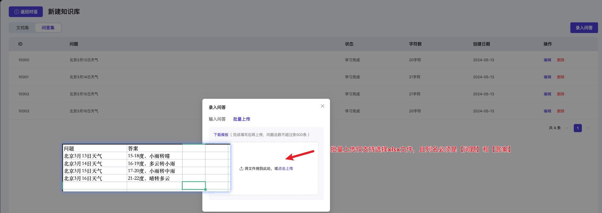
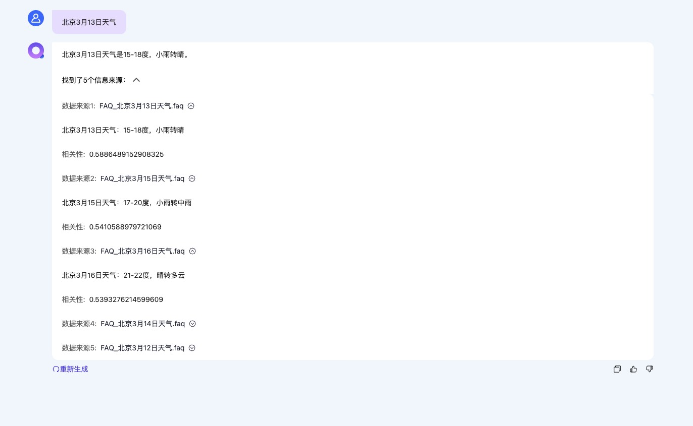
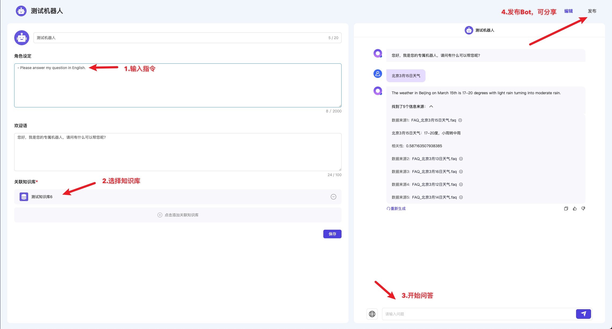
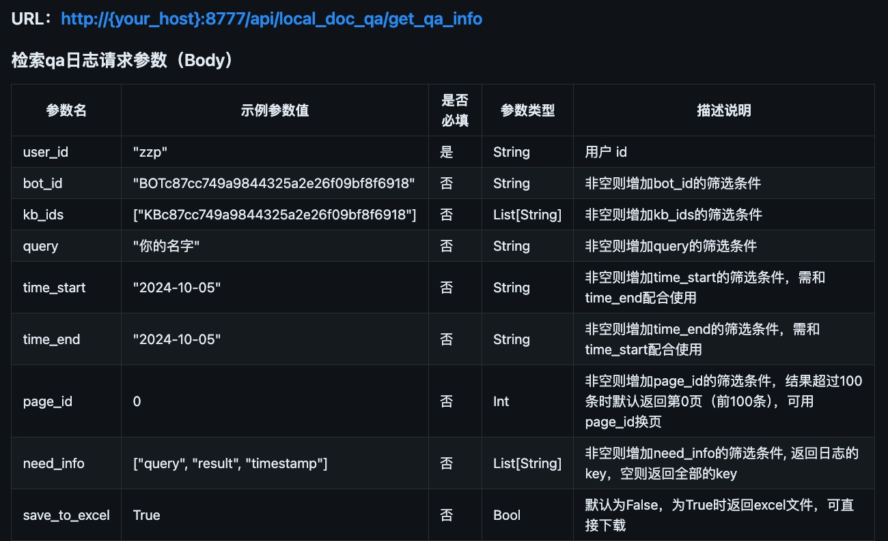
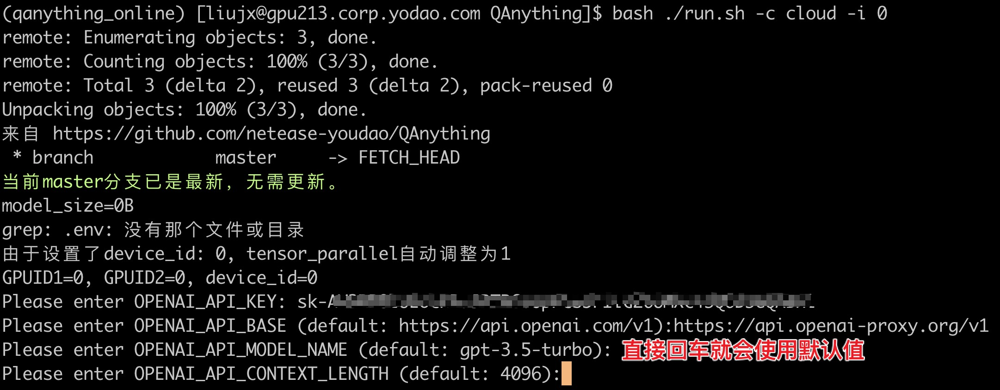

# QAnything使用说明：

## 版本选择说明：

**一句话总结：python版本适合快速体验新功能，docker版本适合二次开发并用于实际生产环境，新功能暂缓支持**

## 有定制化商业需求请添加企业微信或电话联系：010-82558901


| 特性                                | python版本                                                                              | docker版本                                                                    | 说明                                                             |
|-----------------------------------|---------------------------------------------------------------------------------------|-----------------------------------------------------------------------------|----------------------------------------------------------------|
| 详细安装文档                            | ✅ [详情](#Python版本使用指南)                                                                 | ✅ [详情](#docker版本使用指南)                                                       |                                                                |
| API支持                             | ✅ [详情](https://github.com/netease-youdao/QAnything/blob/qanything-python/docs/API.md) | ✅ [详情](https://github.com/netease-youdao/QAnything/blob/master/docs/API.md) |                                                                |
| 生产环境（小型生产环境）                      | ❌                                                                                     | ✅                                                                           |                                                                |
| 断网安装（私有化部署）                       | ❌                                                                                     | ✅ [详情](#断网安装)                                                               |                                                                |
| 支持多并发                             | ❌                                                                                     | ✅ [详情](#多并发)                                                                | python在使用API而非本地大模型时可手动设置：[详情](#多并发)                           |
| 支持多卡推理                            | ❌                                                                                     | ✅ [详情](#多卡推理)                                                               |                                                                |
| 支持Mac（M系列芯片）                      | ✅                                                                                     | ❌                                                                           | 目前在mac下运行本地LLM依赖llamacpp，问答速度较慢（最长数分钟），建议使用Openai-API的方式调用模型服务 |
| 支持Linux                           | ✅                                                                                     | ✅                                                                           | python版本Linux下默认使用onnxruntime-gpu，glibc<2.28时自动切换为onnxruntime  |
| 支持windows WSL                     | ✅                                                                                     | ✅                                                                           |                                                                |
| 支持纯CPU环境                          | ✅ [详情](#纯CPU模式)                                                                       | ❌                                                                           |                                                                |
| 支持混合检索（BM25+embedding）            | ❌                                                                                     | ✅                                                                           |                                                                |
| 支持联网检索（需外网VPN）                    | ✅ [详情](#联网检索)                                                                         | ❌                                                                           | docker版本计划中                                                    |
| 支持FAQ问答                           | ✅ [详情](#支持FAQ)                                                                        | ❌                                                                           | docker版本计划中                                                    |
| 支持自定义机器人（可绑定知识库，可分享）              | ✅ [详情](#支持BOT)                                                                        | ❌                                                                           | docker版本计划中                                                    |
| 支持文件溯源（数据来源可直接点击打开）               | ✅ [详情](#文件溯源)                                                                         | ❌                                                                           | docker版本计划中                                                    |
| 支持问答日志检索（暂只支持通过API调用）             | ✅ [详情](#问答日志检索)                                                                       | ❌                                                                           | docker版本计划中                                                    |
| 支持解析语音文件（依赖faster_whisper，解析速度慢）  | ✅                                                                                     | ❌                                                                           | docker版本计划中，上传文件时可支持mp3，wav格式文件                                |
| 支持OpenCloudOS                     | ✅[详情](#支持OpenCloudOS)                                                                 | ❌                                                                           |                                                                |
| 支持与OpenAI接口兼容的其他开源大模型服务(包括ollama) | ✅ [详情](#python版OpenaiAI接口兼容)                                                          | ✅ [详情](#docker版OpenaiAI接口兼容)                                                | 需手动修改api_key，base_url，model等参数                                 |
| pdf（包含表格）解析效果+++                  | ✅ [详情:需手动开启](#pdf包含表格解析效果)                                                            | ❌                                                                           |                                                                |
| 用户自定义配置（实验性：提升速度）                 | ✅ [详情:需手动开启](#用户自定义配置实验性提升速度)                                                         | ❌                                                                           |                                                                |
| 其他文件类型解析效果+++                     | ❌                                                                                     | ❌                                                                           | 预计下个版本发布（15d）                                                  |

## docker版本使用指南：

docker版本安装攻略（Linux或Win11 WSL环境）

### 必要条件：

| **System** | **Required item**        | **Minimum Requirement**            | **Note**                                                                                                                                                               |
| ---------- | ------------------------ | ---------------------------------- |------------------------------------------------------------------------------------------------------------------------------------------------------------------------|
| Linux      | NVIDIA GPU Memory        | >= 4GB (use OpenAI API)            | 最低: GTX 1050Ti（use OpenAI API） <br> 推荐: RTX 3090                                                                                                                       |
|            | NVIDIA Driver Version    | >= 525.105.17                      | [Nvidia Driver Downloads](https://www.nvidia.com/download/index.aspx) 或 [小白攻略](#一安装nvidia-driver-52510517)                                                             |
|            | Docker version           | >= 20.10.5                         | [Docker install](https://docs.docker.com/engine/install/) 或 [小白攻略](#二安装docker20105和docker-compose2233)                                                                 |
|            | docker compose  version  | >= 2.23.3                          | [docker compose install](https://docs.docker.com/compose/install/) 或 [小白攻略](#二安装docker20105和docker-compose2233)                                                        |
|            | NVIDIA Container Toolkit | latest                             | [NVIDIA Container Toolkit install](https://docs.nvidia.com/datacenter/cloud-native/container-toolkit/latest/install-guide.html) 或 [小白攻略](#三安装nvidia-container-toolkit) |
|            | git && git-lfs           | latest                             | [git-lfs install](https://git-lfs.com/)  或 [小白攻略](#四安装git和git-lfs)                                                                                                              |
|            | RAM（内存大小）                | >=8GB（不使用本地大模型）<br>>=16GB（使用本地大模型） | 启动服务失败但不报错时大概率是内存不足，请时刻关注内存使用情况 <br>使用本地部署的大模型时：推荐内存>=16GB，使用API等方式调用大模型时：推荐内存>=8GB<br>内存>=32GB时可获得最佳体验                                                                |

## 一、安装NVIDIA Driver （>=525.105.17）

### 步骤 1：准备工作

要检查已安装的 NVIDIA 驱动版本和 CUDA 版本，然后根据需要卸载旧版本，你可以遵循以下步骤：

### 检查 NVIDIA 驱动

1. **检查 NVIDIA 驱动版本**：
   打开终端，然后输入以下命令来检查当前安装的 NVIDIA 驱动版本：
   
   ```bash
   nvidia-smi
   ```
   
   这个命令将输出一些关于 NVIDIA GPU 的信息，包括安装的驱动版本。查看输出中的 "Driver Version"
   
   如果已经满足版本要求则可以跳过

### 如果需要卸载旧版本

如果检查结果显示 NVIDIA 驱动版本低于 525，你需要先卸载它们。

#### 卸载 NVIDIA 驱动

对于 NVIDIA 驱动，可以通过运行下列命令来卸载：

```bash
sudo apt-get purge nvidia-*
```

然后，重启你的计算机：

```bash
sudo reboot
```

### 更新依赖

1. **更新系统**：首先，更新你的系统包列表和系统本身，确保所有的依赖都是最新的。
   
   ```bash
   sudo apt update
   sudo apt upgrade
   ```

2. **安装必要的依赖**：
   
   ```bash
   sudo apt install build-essential
   ```

### 步骤 2：禁用 Nouveau 驱动（如果已卸载过旧版驱动可跳过）

Ubuntu 默认使用 Nouveau 驱动程序来支持 NVIDIA 的显卡。在安装官方 NVIDIA 驱动前，你需要禁用 Nouveau 驱动。

1. 打开 `/etc/modprobe.d/blacklist-nouveau.conf` 文件：
   
   ```bash
   sudo nano /etc/modprobe.d/blacklist-nouveau.conf
   ```
   
   添加以下内容后保存：
   
   ```
   blacklist nouveau
   options nouveau modeset=0
   ```

2. 更新初始化 RAM 文件系统：
   
   ```bash
   sudo update-initramfs -u
   ```

3. 重启你的系统：
   
   ```bash
   sudo reboot
   ```

### 步骤 3：安装 NVIDIA 驱动

1. **添加 NVIDIA 的 PPA**（可选，但推荐）：
   
   ```bash
   sudo add-apt-repository ppa:graphics-drivers/ppa
   sudo apt update
   ```

2. **安装 NVIDIA 驱动**：
   
   ```bash
   ubuntu-drivers devices  # 可用来查询可用的显卡驱动版本，选择大于等于525的版本
   sudo apt install nvidia-driver-535
   ```
   
   请将 `nvidia-driver-535` 替换为适合你的显卡的驱动版本。

3. **重启**：
   安装完成后，重启你的系统：
   
   ```bash
   sudo reboot
   ```

## 二、安装docker（>=20.10.5）和docker-compose（>=2.23.3）

### 步骤 1：检查已安装的 Docker 和 Docker Compose 版本

1. **检查 Docker 版本**：
   打开终端并输入以下命令：
   
   ```bash
   docker --version
   ```
   
   如果已安装 Docker，此命令将输出当前安装的 Docker 版本。

2. **检查 Docker Compose 版本**：
   对于 Docker Compose，运行：
   
   ```bash
   docker compose version
   ```
   
   或者，如果是使用旧版本的 Docker Compose（1.x 版本），可能需要运行：
   
   ```bash
   docker-compose -v
   ```

### 步骤 2：如果需要，卸载旧版本

如果已安装 Docker 或 Docker Compose 但版本不符合要求，则需要卸载它们。

1. **卸载 Docker**：
   
   ```bash
   sudo apt-get remove docker docker-engine docker.io containerd runc
   ```

2. **卸载 Docker Compose**：
   如果是通过包管理器安装的 Docker Compose，可以用 `apt-get` 移除：
   
   ```bash
   sudo apt-get remove docker-compose
   ```
   
   如果是手动安装（如放置在 `/usr/local/bin/docker-compose`），则需要手动删除：
   
   ```bash
   sudo rm /usr/local/bin/docker-compose
   ```

### 步骤 3：安装 Docker

确保安装版本大于 20.10.5。

1. **设置 Docker 仓库**：
   首先，更新 `apt` 包索引，并安装一些必需的包，这些包允许 `apt` 通过 HTTPS 使用仓库：
   
   ```bash
   sudo apt-get update
   sudo apt-get install \
     ca-certificates \
     curl \
     gnupg \
     lsb-release
   ```

2. **添加 Docker 的官方 GPG 密钥**：
   
   ```bash
   curl -fsSL https://download.docker.com/linux/ubuntu/gpg | sudo gpg --dearmor -o /usr/share/keyrings/docker-archive-keyring.gpg
   ```

3. **设置稳定版仓库**：
   
   ```bash
   echo \
   "deb [arch=$(dpkg --print-architecture) signed-by=/usr/share/keyrings/docker-archive-keyring.gpg] https://download.docker.com/linux/ubuntu \
   $(lsb_release -cs) stable" | sudo tee /etc/apt/sources.list.d/docker.list > /dev/null
   ```

4. **安装 Docker Engine**：
   
   ```bash
   sudo apt-get update
   sudo apt-get install docker-ce docker-ce-cli containerd.io
   ```

5. **验证 Docker 安装**：
   
   ```bash
   sudo docker run hello-world
   ```
   
   这应该会下载一个测试镜像并在容器中运行它，证明 Docker 已正确安装。

### 步骤 4：安装 Docker Compose

确保安装版本大于 2.23.3。

1. **下载 Docker Compose**：
   你可以从 Docker 的 GitHub 仓库直接下载 Docker Compose 二进制文件。以安装版本 2.24.1 为例（请根据需要调整版本号）：
   
   ```bash
   sudo curl -L "https://github.com/docker/compose/releases/download/v2.24.1/docker-compose-$(uname -s)-$(uname -m)" -o /usr/local/bin/docker-compose
   # 如果发现速度过慢，可以尝试使用下面的国内源
   sudo curl -SL https://mirror.ghproxy.com/https://github.com/docker/compose/releases/download/v2.24.1/docker-compose-`uname -s`-`uname -m` -o /usr/local/bin/docker-compose
   ```

2. **使二进制文件可执行**：
   
   ```bash
   sudo chmod +x /usr/local/bin/docker-compose
   ```

3. **测试安装**：
   
   ```bash
   docker-compose -v
   ```
   
   确认输出的版本号满足您的要求。

完成以上步骤后，您将拥有满足版本要求的 Docker 和 Docker Compose。如果遇到任何问题，可能需要根据错误消息调整某些命令。

## 三、安装NVIDIA Container Toolkit

### 步骤 1：检查 NVIDIA Docker Toolkit 是否已安装

1. **检查 NVIDIA Container Runtime**：
   
   ```bash
   docker info | grep nvidia
   ```
   
   如果已经安装了 NVIDIA Container Toolkit，你应该能在输出中看到有关 NVIDIA 的信息。如果没有找到，表示可能尚未安装。

### 步骤 2：安装 NVIDIA Container Toolkit

如果 NVIDIA Container Toolkit 尚未安装，你可以按照以下步骤进行安装：

1. **配置 NVIDIA Docker 仓库**：
   
   ```bash
   curl -fsSL https://nvidia.github.io/libnvidia-container/gpgkey | sudo gpg --dearmor -o /usr/share/keyrings/nvidia-container-toolkit-keyring.gpg \
     && curl -s -L https://nvidia.github.io/libnvidia-container/stable/deb/nvidia-container-toolkit.list | \
       sed 's#deb https://#deb [signed-by=/usr/share/keyrings/nvidia-container-toolkit-keyring.gpg] https://#g' | \
       sudo tee /etc/apt/sources.list.d/nvidia-container-toolkit.list
   ```

2. **更新软件包列表**：
   
   ```bash
   sudo apt-get update
   ```

3. **安装 NVIDIA Docker**：
   
   ```bash
   sudo apt-get install -y nvidia-container-toolkit
   ```

4. **配置并重启 Docker 服务**：
   
   ```bash
   sudo nvidia-ctk runtime configure --runtime=docker
   sudo systemctl restart docker
   ```

## 四、安装git和git-lfs

要检查 Git 和 Git Large File Storage (Git LFS) 是否已安装，并在需要时安装它们，你可以按照以下步骤操作：

### 检查 Git 是否已安装

1. **检查 Git 版本**：
   打开终端，然后输入以下命令来检查 Git 是否已安装，以及其版本：
   
   ```bash
   git --version
   ```
   
   如果这个命令返回了一个版本号，比如 `git version 2.25.1`，这意味着 Git 已经安装在你的系统上。如果终端显示消息说找不到 `git` 命令，那么你需要安装 Git。

### 安装 Git

如果 Git 未安装，你可以使用你的系统的包管理器来安装：

```bash
sudo apt update
sudo apt install git
```

### 检查 Git LFS 是否已安装

1. **检查 Git LFS 版本**：
   类似地，要检查 Git LFS 是否已安装，运行：
   
   ```bash
   git lfs version
   ```
   
   如果这个命令返回了一个版本号，那么 Git LFS 已经安装在你的系统上。如果终端显示消息说找不到 `git lfs` 命令，则需要安装 Git LFS。

### 安装 Git LFS

如果 Git LFS 未安装，你可以按照以下步骤来安装：

1. **下载并安装 Git LFS**：
   
   ```bash
   curl -s https://packagecloud.io/install/repositories/github/git-lfs/script.deb.sh | sudo bash
   sudo apt-get install git-lfs
   ```

2. **设置 Git LFS**：
   安装完 Git LFS 后，你需要运行一次 `git lfs install` 来设置它：
   
   ```bash
   git lfs install
   ```

## 五、安装QAnything

### 下载本项目并执行

```bash
git clone https://github.com/netease-youdao/QAnything.git
cd QAnything
bash run.sh  # 默认在0号GPU上启动，要求30系列，或40系列或A系列显卡且显存大于等于24GB
# 启动后根据实际情况选择输入remote（在云服务器上启动），或local（在本地机器上启动）
# 随后视情况输入ip地址
```

### 如果提示不支持默认后端，可以按如下步骤执行

#### 显存大于等于22GB

```bash
cd /path/to/QAnything/assets/custom_models
git clone https://www.modelscope.cn/models/netease-youdao/Qwen-7B-QAnything
cd /path/to/QAnything
bash ./run.sh -c local -i 0 -b hf -m Qwen-7B-QAnything -t qwen-7b-qanything
```

#### 显存大于等于16GB小于22GB，建议使用3B大模型，以下是使用MiniChat-2-3B的示例

```bash
cd /path/to/QAnything/assets/custom_models
git clone https://www.modelscope.cn/netease-youdao/MiniChat-2-3B.git
cd /path/to/QAnything
bash ./run.sh -c local -i 0 -b hf -m MiniChat-2-3B -t minichat
```

#### 显存小于16GB可尝试使用1.8B大模型或直接使用openai api

```bash
# 使用openai api
bash ./run.sh -c cloud -i 0 -b default
# 根据提示输入api-key和api-base等参数
```

### 启动成功后可在访问前端页面使用

在浏览器中打开http://{your_host}:8777/qanything/

默认一般是http://0.0.0.0:8777/qanything/

即可使用UI界面

注意末尾的斜杠不可省略，否则会出现404错误

### 也可以访问后端API使用

[API](https://github.com/netease-youdao/QAnything/blob/master/docs/API.md)

### API访问示例

```python
python scripts/new_knowledge_base.py  # print kb_id
python scripts/upload_files.py <kb_id> scripts/weixiaobao.jpg  # print file_id
python scripts/list_files.py <kb_id>  # print files status
python scripts/stream_file.py <kb_id> # print llm res
```

## Python版本使用指南：

### 必要条件:

- Python 3.10+ (建议使用aoaconda3来管理Python环境)
- System 
  - Linux: CPU模式：无，非CPU模式：glibc 2.28+ and Cuda 12.0+ （来源于onnxruntime-gpu cuda12.x版本的依赖，如果低于2.28自动切换onnxruntime）
  - Windows: CPU模式：WSL with Ubuntu 18.04+ ，非CPU模式：WSL with Ubuntu 20.04+ 和 桌面版GEFORCE EXPERIENCE 535.104+
  - MacOS（M1/M2/M3）: 使用Openai-API兼容接口模式：无，本地大模型模式：Xcode 15.0+（llamacpp依赖Xcode）

<h3><span style="color:red;">请创建一个干净的Python虚拟环境，以避免潜在冲突（推荐使用Anaconda3）。</span></h3>

安装软件包，请运行: 

```bash
conda create -n qanything-python python=3.10
conda activate qanything-python
git clone -b qanything-python https://github.com/netease-youdao/QAnything.git
cd QAnything
pip install -r requirements.txt
# 请根据使用环境选择启动脚本：bash scripts/xxx（内部调用纯python启动代码，可手动修改python启动命令）
```

## 在Windows WSL或Linux环境下运行3B大模型（MiniChat-2-3B）要求显存>=10GB

```bash
bash scripts/run_for_3B_in_Linux_or_WSL.sh
```

## 在Windows WSL或Linux环境下运行7B大模型（自研Qwen-7B-QAnything）要求显存>=24GB

```bash
bash scripts/run_for_7B_in_Linux_or_WSL.sh
```

## 在Windows WSL或Linux环境下运行Openai API，仅使用CPU
### 纯CPU模式

<span style="color:red;">在scripts/run_for_openai_api_with_cpu_in_Linux_or_WSL.sh中补充api-key等参数</span>

```bash
bash scripts/run_for_openai_api_with_cpu_in_Linux_or_WSL.sh
```

### <h3><p id="BCSM">补充说明：</p></h3>

#### 通义千问DashScope支持：

支持任意与Openai API接口兼容的其他API，例：[通义千问DashScopeAPI](https://help.aliyun.com/zh/dashscope/developer-reference/compatibility-of-openai-with-dashscope/?spm=a2c4g.11186623.0.0.556a140bDcfr3B)

按照约定修改sh脚本中的-b(openai_api_base)，-k(openai_api_key)，-n(openai_api_model_name)等参数即可

#### ollama支持：

同样使用Openai API兼容接口：

例如：当本地运行ollama run llama3，修改scripts/run_for_openai_api_with_cpu_in_Linux_or_WSL.sh内容为：

```bash
bash scripts/base_run.sh -s "LinuxOrWSL" -w 4 -m 19530 -q 8777 -o -b 'http://localhost:11434/v1' -k 'ollama' -n 'llama3' -l '4096'
```

## 在Windows WSL或Linux环境下运行Openai API，使用GPU

<span style="color:red;">在scripts/run_for_openai_api_with_gpu_in_Linux_or_WSL.sh中补充api-key等参数</span>

```bash
bash scripts/run_for_openai_api_with_gpu_in_Linux_or_WSL.sh
```

[补充说明](#BCSM)

## 在M1Mac环境下使用Openai API

<span style="color:red;">在scripts/run_for_openai_api_in_M1_mac.sh中补充api-key等参数</span>

```bash
bash scripts/run_for_openai_api_in_M1_mac.sh
```

[补充说明](#BCSM)

## 在M1Mac环境下使用3BLLM（MiniChat-2-3B-GGUF）

<span style="color:red;">Mac上建议使用Openai API, 本地模型效果不佳，运行速度较慢</span>

```bash
bash scripts/run_for_4B_in_M1_mac.sh
```

## 访问前端页面

在浏览器中打开http://{your_host}:8777/qanything/

默认一般是http://0.0.0.0:8777/qanything/

即可使用UI界面

注意末尾的斜杠不可省略，否则会出现404错误

## API 文档

[API.md](https://github.com/netease-youdao/QAnything/blob/qanything-python/docs/API.md)

### API访问示例

```python
python scripts/new_knowledge_base.py  # print kb_id
python scripts/upload_files.py <kb_id> scripts/weixiaobao.jpg  # print file_id
python scripts/list_files.py <kb_id>  # print files status
python scripts/stream_file.py <kb_id> # print llm res
```

## 功能详细说明

### 断网安装

### windows断网安装

如果您想要断网安装QAnything，您可以使用以下命令启动服务。

```shell
# 先在联网机器上下载docker镜像
docker pull quay.io/coreos/etcd:v3.5.5
docker pull minio/minio:RELEASE.2023-03-20T20-16-18Z
docker pull milvusdb/milvus:v2.3.4
docker pull mysql:latest
docker pull freeren/qanything-win:v1.2.x  # 从 [https://github.com/netease-youdao/QAnything/blob/master/docker-compose-windows.yaml#L103] 中获取最新镜像版本号。

# 打包镜像
docker save quay.io/coreos/etcd:v3.5.5 minio/minio:RELEASE.2023-03-20T20-16-18Z milvusdb/milvus:v2.3.4 mysql:latest freeren/qanything-win:v1.2.x -o qanything_offline.tar

# 下载QAnything代码
wget https://github.com/netease-youdao/QAnything/archive/refs/heads/master.zip

# 把镜像qanything_offline.tar和代码QAnything-master.zip拷贝到断网机器上
cp QAnything-master.zip qanything_offline.tar /path/to/your/offline/machine

# 在断网机器上加载镜像
docker load -i qanything_offline.tar

# 解压代码，运行
unzip QAnything-master.zip
cd QAnything-master
bash run.sh
# 注意上述命令仅适用于使用自研7B模型的情况，硬件要求30系，40系，或A系列显卡且显存>=24GB
# 如果不是，则根据此文档选择合适的模型或后端启动，此时需要增加手动下载模型的步骤：
# 下载非默认模型：(以下为使用MiniChat-2-3B示例，请按需更改)
cd QAnything-master/assets/custom_models
git lfs install
git clone https://www.modelscope.cn/netease-youdao/MiniChat-2-3B.git  # 可从有网络的地方下载后转移到无网机器的QAnything-master/assets/custom_models文件夹下即可
cd ../../
bash ./run.sh -c local -i 0 -b hf -m MiniChat-2-3B -t minichat
```

### Linux断网安装

如果您想要断网安装QAnything，您可以使用以下命令启动服务。

```shell
# 先在联网机器上下载docker镜像
docker pull quay.io/coreos/etcd:v3.5.5
docker pull minio/minio:RELEASE.2023-03-20T20-16-18Z
docker pull milvusdb/milvus:v2.3.4
docker pull mysql:latest
docker pull freeren/qanything:v1.2.x  # 从 [https://github.com/netease-youdao/qanything/blob/master/docker-compose-linux.yaml#L104] 中获取最新镜像版本号。

# 打包镜像
docker save quay.io/coreos/etcd:v3.5.5 minio/minio:RELEASE.2023-03-20T20-16-18Z milvusdb/milvus:v2.3.4 mysql:latest freeren/qanything:v1.2.x -o qanything_offline.tar

# 下载QAnything代码
wget https://github.com/netease-youdao/QAnything/archive/refs/heads/master.zip

# 把镜像qanything_offline.tar和代码QAnything-master.zip拷贝到断网机器上
cp QAnything-master.zip qanything_offline.tar /path/to/your/offline/machine

# 在断网机器上加载镜像
docker load -i qanything_offline.tar

# 解压代码，运行
unzip QAnything-master.zip
cd QAnything-master
bash run.sh
# 注意上述命令仅适用于使用自研7B模型的情况，硬件要求30系，40系，或A系列显卡且显存>=24GB
# 如果不是，则根据此文档选择合适的模型或后端启动，此时需要增加手动下载模型的步骤：
# 下载非默认模型：(以下为使用MiniChat-2-3B示例，请按需更改)
cd QAnything-master/assets/custom_models
git lfs install
git clone https://www.modelscope.cn/netease-youdao/MiniChat-2-3B.git  # 可从有网络的地方下载后转移到无网机器的QAnything-master/assets/custom_models文件夹下即可
cd ../../
bash ./run.sh -c local -i 0 -b hf -m MiniChat-2-3B -t minichat
```

### 多卡推理
#### 当使用vllm后端时：（bash run.sh启动时指定-b参数为vllm） 
支持多卡推理大模型，以下示例为4张卡启动，默认embedding，部署在第一张卡上，rerank，ocr模型部署在第二张卡上，四张卡剩余显存均会用于LLM推理
```bash
bash ./run.sh -c local -i 0,1,2,3 -b vllm -m Qwen-7B-QAnything -t qwen-7b-qanything # 指定0,1,2,3号GPU启动，请确认有多张GPU可用，注意设备数量必须是1，2，4，8，16，否则显存无法正常分配
```
注意：使用默认的自研Qwen-7B-QAnything模型目前要求显卡算力在8.0以上，因此仅支持30系，40系，或A系列显卡，其他显卡型号请选择其他开源模型：可参考[模型列表](https://github.com/netease-youdao/QAnything/blob/master/docs/QAnything_Startup_Usage_README.md#supported-pulic-llm-using-fastchat-api-with-hugging-face-transformersvllm-runtime-backend)
##### 修改本地模型为MiniChat-2-3B的示例代码如下：
注意下载模型需要先安装[git-lfs](#四安装git和git-lfs)
```bash
cd /path/to/QAnything/assets/custom_models
git lfs install 
git clone https://www.modelscope.cn/netease-youdao/MiniChat-2-3B.git
cd /path/to/QAnything
bash ./run.sh -c local -i 0,1,2,3 -b vllm -m MiniChat-2-3B -t minichat
```

#### 当使用默认后端或hf后端时时：（bash run.sh启动时不指定-b参数或-b参数为default或hf）
不支持多卡推理大模型，此时指定GPU设备的数量不为1时，会自动切换后端为vllm

<span style="color:red;">说明：多卡部署是指大模型运行平均分配显存到多张显卡上，但是由于embedding，rerank和ocr模型也需要占用显存（共需4G+显存，启动时占用2G显存，运行后会逐渐上涨至4G左右），目前这三个模型默认会分配到前两个设备上，所以第一张，第二张显卡的显存占用会比其他卡多2G以上，默认启动参数-r(gpu_memory_utilization)=0.81，如果手动设置为0.9以上可能会存在前两张卡显存不足无法启动或启动后运行时显存不足报错的情况</span>

### 多并发

#### docker版

默认支持多并发，workers默认设置为10，由于ocr，rerank，embedding和llm都是独立的服务，因此并发数并不会增加显存占用，此时可根据实际情况手动修改并发数，

手动修改此行的“workers”参数并重启服务即可：

[QAnything/qanything_kernel/qanything_server/sanic_api.py at master · netease-youdao/QAnything · GitHub](https://github.com/netease-youdao/QAnything/blob/master/qanything_kernel/qanything_server/sanic_api.py#L89)

### python版

默认不支持多并发，由于python版rerank，embedding，llm均与主服务一起启动，（ocr默认使用cpu，不占用显存），因此并发数会增加显存占用，而本地部署llm占用的显存（mac上是内存），因此当使用本地LLM模型时无法使用多并发，当使用API调用可以手动修改并发数，显存（mac上是内存）占用与workers数量成正比，

手动修改此行“single_process=True”为“workers=[想要的并发数]”，注意在某些环境下python多进程启动时上下文会报错：RuntimeError: context has already been set。此时无法使用多并发

[QAnything/qanything_kernel/qanything_server/sanic_api.py at qanything-python · netease-youdao/QAnything · GitHub](https://github.com/netease-youdao/QAnything/blob/qanything-python/qanything_kernel/qanything_server/sanic_api.py#L224)

### 联网检索

注意：联网检索依赖于第三方库：[GitHub - deedy5/duckduckgo_search: Search for words, documents, images, videos, news, maps and text translation using the DuckDuckGo.com search engine. Downloading files and images to a local hard drive.](https://github.com/deedy5/duckduckgo_search)

<span style="color:red;">要求开启外网VPN，如无法获取外网VPN请在前端页面关闭联网检索功能，防止报错</span>

#### 未使用联网问答



#### 使用联网问答（速度较慢）



### 文件溯源

目前仅支持以下格式的文件溯源：

<p style="color:green;">pdf，docx，xlsx，txt，jpg，png，jpeg，联网检索网络链接</p>

示例如下：




### 支持OpenCloudOS

OpenCloudOS是腾讯自研的国产操作系统：[官网](https://opencloudos.org/)

OpenCloud 需要在 Docker 容器中运行，请先安装 Docker：
Docker 版本 >= 20.10.5 且 docker-compose 版本 >= 2.23.3

```bash
docker-compose up -d
docker attach qanything-container
# 启动容器后选择以下4个命令之一来运行：
bash scripts/run_for_3B_in_Linux_or_WSL.sh
bash scripts/run_for_7B_in_Linux_or_WSL.sh
bash scripts/run_for_openai_api_with_cpu_in_Linux_or_WSL.sh
bash scripts/run_for_openai_api_with_gpu_in_Linux_or_WSL.sh
```

### 支持FAQ

#### 前端调用步骤：









#### API调用步骤：

[上传FAQAPI](https://github.com/netease-youdao/QAnything/blob/qanything-python/docs/API.md#%E4%B8%8A%E4%BC%A0faqpost)

上传后直接问答即可，知识库会自动包含FAQ和非FAQ内容

### 支持BOT

#### 前端调用步骤




#### API调用步骤：

[创建Bot](https://github.com/netease-youdao/QAnything/blob/qanything-python/docs/API.md#%E5%88%9B%E5%BB%BAbotpost)

[获取Bot信息](https://github.com/netease-youdao/QAnything/blob/qanything-python/docs/API.md#%E8%8E%B7%E5%8F%96bot%E4%BF%A1%E6%81%AFpost)

[修改Bot信息](https://github.com/netease-youdao/QAnything/blob/qanything-python/docs/API.md#%E8%8E%B7%E5%8F%96bot%E4%BF%A1%E6%81%AFpost)

[删除Bot信息](https://github.com/netease-youdao/QAnything/blob/qanything-python/docs/API.md#%E8%8E%B7%E5%8F%96bot%E4%BF%A1%E6%81%AFpost)

### 问答日志检索

[日志检索API](https://github.com/netease-youdao/QAnything/blob/qanything-python/docs/API.md#%E6%A3%80%E7%B4%A2qa%E6%97%A5%E5%BF%97post)



**支持按多种类型字段筛选，支持自定义返回字段，支持保存成EXCEL文件**

### OPENAI 接口兼容

#### docker版OpenaiAI接口兼容

```bash
bash ./run.sh -c cloud -i 0
# 手动输入api_key，base_url，model_name，context_length，除了api_key外均有默认值，且用户输入会自动保存，下次启动不用再次输入
```



##### 支持任意与OpenaAI接口兼容的服务

**通义千问DashScope支持：[通义千问DashScopeAPI](https://help.aliyun.com/zh/dashscope/developer-reference/compatibility-of-openai-with-dashscope/?spm=a2c4g.11186623.0.0.556a140bDcfr3B)**

```bash
# 示例
openai_api_key = "sk-xxx"
openai_api_base = "https://dashscope.aliyuncs.com/compatible-mode/v1"
openai_model_name = "qwen1.5-72b-chat"
```

**ollama支持：[本地启动ollama服务](https://github.com/ollama/ollama)**

```bash
# 例如，当本地运行ollama run qwen:32b
openai_api_key = "ollama"
openai_api_base = "http://localhost:11434/v1"
openai_api_model_name = "qwen:32b"
```

#### python版OpenaiAI接口兼容

支持任意与OpenaAI接口兼容的服务

**通义千问DashScope支持：[通义千问DashScopeAPI](https://help.aliyun.com/zh/dashscope/developer-reference/compatibility-of-openai-with-dashscope/?spm=a2c4g.11186623.0.0.556a140bDcfr3B)**
自定义scripts/run_for_openai_api_xxx.sh内容为：

```bash
# Linux或WSL上，注意cpu模式需要加-c参数
bash scripts/base_run.sh -s "LinuxOrWSL" -w 4 -m 19530 -q 8777 -o -b 'https://dashscope.aliyuncs.com/compatible-mode/v1' -k 'sk-xxx' -n 'qwen1.5-72b-chat' -l '4096'
# Mac上
bash scripts/base_run.sh -s "M1mac" -w 2 -m 19530 -q 8777 -o -b 'https://dashscope.aliyuncs.com/compatible-mode/v1' -k 'sk-xxx' -n 'qwen1.5-72b-chat' -l '4096'
```

**ollama支持：[本地启动ollama服务](https://github.com/ollama/ollama)**
自定义scripts/run_for_openai_api_xxx.sh内容为：

```bash
# Linux或WSL上，注意cpu模式需要加-c参数
bash scripts/base_run.sh -s "LinuxOrWSL" -w 4 -m 19530 -q 8777 -o -b 'http://localhost:11434/v1' -k 'ollama' -n 'qwen:32b' -l '4096'
# Mac上
bash scripts/base_run.sh -s "M1mac" -w 2 -m 19530 -q 8777 -o -b 'http://localhost:11434/v1' -k 'ollama' -n 'qwen:32b' -l '4096'
```

### pdf（包含表格）解析效果+++
默认使用快速PDF解析器，解析速度快，但是解析效果一般，如果需要更好的解析效果，可以使用以下方式手动开启强力解析器：
典型耗时对比：
环境：Mac M1Pro 16GB，
单页PDF解析耗时：快速解析器耗时约1/30s，强力解析器耗时约1s
原理：快速解析器主要依赖PyMuPDF，强力解析器则使用了表格解析模型和版面分析模型，并做了后处理优化

#### 开启强力解析器的方式：
[设置此处的 USE_FAST_PDF_PARSER = False](https://github.com/netease-youdao/QAnything/blob/qanything-python/qanything_kernel/configs/model_config.py#L13)

### 用户自定义配置（实验性：提升速度）
[代码位置](https://github.com/netease-youdao/QAnything/blob/qanything-python/qanything_kernel/configs/model_config.py#L15)
```bash
# 根据实际情况调整以下参数，对硬件要求更高，但是速度更快
# 设置rerank的batch大小，16GB内存建议设置为8，32GB内存建议设置为16
LOCAL_RERANK_BATCH = 8
# 设置rerank的多线程worker数量，默认设置为4，根据机器性能调整
LOCAL_RERANK_WORKERS = 4
# 设置embed的batch大小，16GB内存建议设置为8，32GB内存建议设置为16
LOCAL_EMBED_BATCH = 8
# 设置embed的多线程worker数量，默认设置为4，根据机器性能调整
LOCAL_EMBED_WORKERS = 4
```
