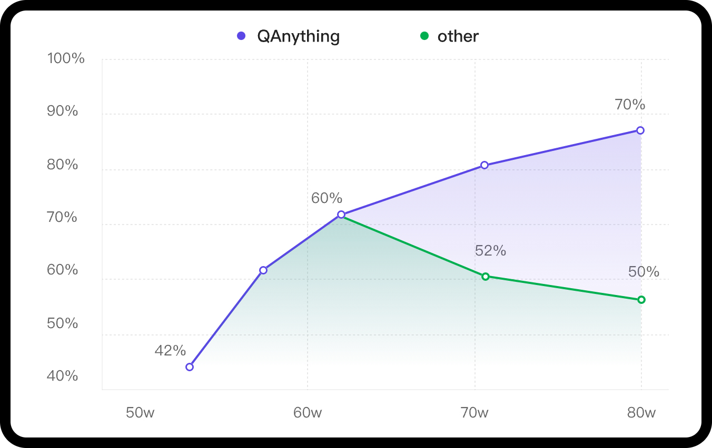

<div align="center">

  <a href="https://github.com/netease-youdao/QAnything">
    <!-- Please provide path to your logo here -->
    
  </a>

# **Q**uestion and **A**nswer based on **Anything**

<p align="center">
  <a href="./README.md">English</a> |
  <a href="./README_zh.md">简体中文</a>
</p>

</div>

<div align="center">

<a href="https://qanything.ai"></a>
&nbsp;&nbsp;&nbsp;&nbsp;
<a href="https://read.youdao.com#/home"></a>
&nbsp;&nbsp;&nbsp;&nbsp;

<a href="./LICENSE"></a>
&nbsp;&nbsp;&nbsp;&nbsp;
<a href="https://github.com/netease-youdao/QAnything/pulls"></a>
&nbsp;&nbsp;&nbsp;&nbsp;
<a href="https://twitter.com/YDopensource"></a>
&nbsp;&nbsp;&nbsp;&nbsp;

<a href="https://discord.gg/5uNpPsEJz8"></a>
&nbsp;&nbsp;&nbsp;&nbsp;


</div>

<details open="open">
<summary>Table of Contents</summary>

- [What is QAnything](#What-is-QAnything)
  - [Key features](#Key-features)
  - [Architecture](#Architecture)
- [Before You Start](#Before-You-Start)
- [Latest Updates](#-Latest-Updates)
- [Getting Started](#getting-started)
  - [Prerequisites](#prerequisites)
  - [Installation](#installation)
- [FAQ](#FAQ)
- [Usage](#usage)
  - [API Document](#API-Document)
- [WeChat Group](#WeChat-Group)
- [Community & Support](#Community--Support)
- [License](#license)
- [Acknowledgements](#Acknowledgments)

</details>

## What is QAnything?
`QAnything`(**Q**uestion and **A**nswer based on **Anything**) is a local knowledge base question-answering system designed to support a wide range of file formats and databases, allowing for offline installation and use.

With `QAnything`, you can simply drop any locally stored file of any format and receive accurate, fast, and reliable answers.

Currently supported formats include: **PDF(pdf)**,**Word(docx)**,**PPT(pptx)**,**XLS(xlsx)**,**Markdown(md)**,**Email(eml)**,**TXT(txt)**,**Image(jpg，jpeg，png)**,**CSV(csv)**,**Web links(html)** and more formats coming soon…


### Key features

- **Data Security**, supports installation and usage with network cable unplugged throughout the process.
- **Cross-language QA support**, freely switch between Chinese and English QA, regardless of the language of the document.
- **Supports massive data QA**, two-stage retrieval ranking, solving the degradation problem of large-scale data retrieval; the more data, the better the performance.
- **High-performance production-grade system**, directly deployable for enterprise applications.
- **User-friendly**, no need for cumbersome configurations, one-click installation and deployment, ready to use.
- **Multi knowledge base QA** Support selecting multiple knowledge bases for Q&A


### Architecture
<div align="center">

</div>

#### Why 2 stage retrieval?
In scenarios with a large volume of knowledge base data, the advantages of a two-stage approach are very clear. If only a first-stage embedding retrieval is used, there will be a problem of retrieval degradation as the data volume increases, as indicated by the green line in the following graph. However, after the second-stage reranking, there can be a stable increase in accuracy, **the more data, the better the performance**.
<div align="center">

</div>

QAnything uses the retrieval component [BCEmbedding](https://github.com/netease-youdao/BCEmbedding), which is distinguished for its bilingual and crosslingual proficiency. BCEmbedding excels in bridging Chinese and English linguistic gaps, which achieves
- **A high performance on <a href="https://github.com/netease-youdao/BCEmbedding/tree/master?tab=readme-ov-file#evaluate-semantic-representation-by-mteb" target="_Self">Semantic Representation Evaluations in MTEB</a>**;
- **A new benchmark in the realm of <a href="https://github.com/netease-youdao/BCEmbedding/tree/master?tab=readme-ov-file#evaluate-rag-by-llamaindex" target="_Self">RAG Evaluations in LlamaIndex</a>**.


#### 1st Retrieval（embedding）
| Model | Retrieval | STS | PairClassification | Classification | Reranking | Clustering | Avg |  
|:-------------------------------|:--------:|:--------:|:--------:|:--------:|:--------:|:--------:|:--------:|  
| bge-base-en-v1.5 | 37.14 | 55.06 | 75.45 | 59.73 | 43.05 | 37.74 | 47.20 |  
| bge-base-zh-v1.5 | 47.60 | 63.72 | 77.40 | 63.38 | 54.85 | 32.56 | 53.60 |  
| bge-large-en-v1.5 | 37.15 | 54.09 | 75.00 | 59.24 | 42.68 | 37.32 | 46.82 |  
| bge-large-zh-v1.5 | 47.54 | 64.73 | **79.14** | 64.19 | 55.88 | 33.26 | 54.21 |  
| jina-embeddings-v2-base-en | 31.58 | 54.28 | 74.84 | 58.42 | 41.16 | 34.67 | 44.29 |  
| m3e-base | 46.29 | 63.93 | 71.84 | 64.08 | 52.38 | 37.84 | 53.54 |  
| m3e-large | 34.85 | 59.74 | 67.69 | 60.07 | 48.99 | 31.62 | 46.78 |  
| ***bce-embedding-base_v1*** | **57.60** | **65.73** | 74.96 | **69.00** | **57.29** | **38.95** | ***59.43*** |  

- More evaluation details please check [Embedding Models Evaluation Summary](https://github.com/netease-youdao/BCEmbedding/blob/master/Docs/EvaluationSummary/embedding_eval_summary.md)。

#### 2nd Retrieval（rerank）
| Model | Reranking | Avg |  
|:-------------------------------|:--------:|:--------:|  
| bge-reranker-base | 57.78 | 57.78 |  
| bge-reranker-large | 59.69 | 59.69 |  
| ***bce-reranker-base_v1*** | **60.06** | ***60.06*** |  

- More evaluation details please check [Reranker Models Evaluation Summary](https://github.com/netease-youdao/BCEmbedding/blob/master/Docs/EvaluationSummary/reranker_eval_summary.md)

#### RAG Evaluations in LlamaIndex（embedding and rerank）


***NOTE:***

- In `WithoutReranker` setting, our `bce-embedding-base_v1` outperforms all the other embedding models.
- With fixing the embedding model, our `bce-reranker-base_v1` achieves the best performance.
- **The combination of `bce-embedding-base_v1` and `bce-reranker-base_v1` is SOTA**.
- If you want to use embedding and rerank separately, please refer to [BCEmbedding](https://github.com/netease-youdao/BCEmbedding)

#### LLM

The open source version of QAnything is based on QwenLM and has been fine-tuned on a large number of professional question-answering datasets. It greatly enhances the ability of question-answering.
If you need to use it for commercial purposes, please follow the license of QwenLM. For more details, please refer to: [QwenLM](https://github.com/QwenLM/Qwen)

## Before You Start
**Star us on GitHub, and be instantly notified for new release!**

* [🏄 Try QAnything Online](https://qanything.ai)
* [📚 Try read.youdao.com | 有道速读](https://read.youdao.com)
* [🛠️ Only use our BCEmbedding(embedding & rerank)](https://github.com/netease-youdao/BCEmbedding)
* [📖 FAQ](FAQ_zh.md)

## 🚀 Latest Updates

- ***2024-01-29***: **Support for custom large models, including OpenAI API and other open-source large models, with a minimum GPU requirement of GTX 1050Ti, greatly improving deployment, debugging, and user experience.** - See More👉 [v1.2.0](https://github.com/netease-youdao/QAnything/releases/tag/v1.2.0)
- ***2024-01-23***: **Enable rerank by default and fix various issues when starting on Windows.** - See More👉 [v1.1.1](https://github.com/netease-youdao/QAnything/releases/tag/v1.1.1)
- ***2024-01-18***: **Support one-click startup, support Windows deployment, improve PDF, XLSX, HTML parsing efficiency.** - See More👉 [v1.1.0](https://github.com/netease-youdao/QAnything/releases/tag/v1.1.0)

## Getting Started

### Prerequisites
#### **For Linux**
|**System**| **Required item**  | **Minimum Requirement** | **Note**                                                         |
|---------------------------|--------------------|-------------------------|------------------------------------------------------------------|
|Linux | NVIDIA GPU Memory  | >= 4GB (use OpenAI API) | Minimum: GTX 1050Ti(use OpenAI API) <br> Recommended: RTX 3090                   |
|      | NVIDIA Driver Version | >= 525.105.17           |                                                                  |
|      |  Docker version    | >= 20.10.5              | [Docker install](https://docs.docker.com/engine/install/)        |
|      | docker compose  version | >= 2.23.3               | [docker compose install](https://docs.docker.com/compose/install/) |
|      | git-lfs   |                         | [git-lfs install](https://git-lfs.com/)                          |

#### **For Windows with WSL Ubuntu Subsystem**
| **System**                    | **Required item**        | **Minimum Requirement** | **Note**                                                                                                                  |
|-------------------------------|--------------------------|-------------------------|---------------------------------------------------------------------------------------------------------------------------|
| Windows with WSL Ubuntu Subsystem | NVIDIA GPU Memory | >= 4GB (use OpenAI API) | Minimum: GTX 1050Ti(use OpenAI API) <br> Recommended: RTX 3090                                                            |                                                                |
|                               | GEFORCE EXPERIENCE    | >= 546.33 | [GEFORCE EXPERIENCE download](https://us.download.nvidia.com/GFE/GFEClient/3.27.0.120/GeForce_Experience_v3.27.0.120.exe) |                                                                                               |
|                               |  Docker Desktop           | >=  4.26.1（131620）     | [Docker Desktop for Windows](https://docs.docker.com/desktop/install/windows-install/)                                    |
|                               | git-lfs   |                  | [git-lfs install](https://git-lfs.com/)                                                                                   |


### Installation
### step1: pull qanything repository
```shell
git clone https://github.com/netease-youdao/QAnything.git
```
### step2: Enter the project root directory and execute the startup script.
* [📖 QAnything_Startup_Usage](docs/QAnything_Startup_Usage_README.md)
* Get detailed usage of LLM interface by ```bash ./run.sh -h```

```shell
cd QAnything
bash run.sh  # Start on GPU 0 by default.
```

<details>
<summary>(Note) If automatic download fails, you can manually download the model from one of the three addresses below.</summary>

modelscope: https://modelscope.cn/models/netease-youdao/QAnything

wisemodel: https://wisemodel.cn/models/Netease_Youdao/qanything

huggingfase: https://huggingface.co/netease-youdao/QAnything

</details>

<details>
<summary>(Optional) Specify GPU startup </summary>

```shell
cd QAnything
bash ./run.sh -c local -i 0 -b default  # gpu id 0
```
</details>

<details>
<summary>(Optional) Specify GPU startup - Recommended for Windows10/Windows11 WSL2 User</summary>

```shell
# For Windows OS: Need to enter the **WSL2** environment.
# Step 1. Download the public LLM model (e.g., Qwen-7B-QAnything) and save to "/path/to/QAnything/assets/custom_models"
# (Optional) Download Qwen-7B-QAnything from ModelScope: https://www.modelscope.cn/models/netease-youdao/Qwen-7B-QAnything
# (Optional) Download Qwen-7B-QAnything from Huggingface: https://huggingface.co/netease-youdao/Qwen-7B-QAnything
cd QAnything/assets/custom_models
git clone https://huggingface.co/netease-youdao/Qwen-7B-QAnything

# Step 2. Execute the service startup command. Here we use "-b hf" to specify the Huggingface transformers backend.
cd ../../
bash ./run.sh -c local -i 0 -b hf -m Qwen-7B-QAnything -t qwen-7b-qanything
```
</details>

<details>
<summary>(Optional) Specify GPU startup - Recommended for GPU Compute Capability >= 8.6 and VRAM >= 24GB</summary>

```shell
# GPU Compute Capability: https://developer.nvidia.com/cuda-gpus
# Step 1. Download the public LLM model (e.g., Qwen-7B-QAnything) and save to "/path/to/QAnything/assets/custom_models"
# (Optional) Download Qwen-7B-QAnything from ModelScope: https://www.modelscope.cn/models/netease-youdao/Qwen-7B-QAnything
# (Optional) Download Qwen-7B-QAnything from Huggingface: https://huggingface.co/netease-youdao/Qwen-7B-QAnything
cd QAnything/assets/custom_models
git clone https://huggingface.co/netease-youdao/Qwen-7B-QAnything

# Step 2. Execute the service startup command. Here we use "-b vllm" to specify the vllm backend.
cd ../../
bash ./run.sh -c local -i 0 -b vllm -m Qwen-7B-QAnything -t qwen-7b-qanything -p 1 -r 0.85
```
</details>

<details>
<summary>(Optional) Specify multi-GPU startup </summary>

```shell
cd QAnything
bash ./run.sh -c local -i 0,1 -b default  # gpu ids: 0,1, Please confirm how many GPUs are available. Supports up to two cards for startup. 
```
</details>

### step3: start to experience
#### Front end
After successful installation, you can experience the application by entering the following addresses in your web browser.

- Front end address: http://`your_host`:5052/qanything/

#### API
If you want to visit API, please refer to the following address:
- API address: http://`your_host`:8777/api/
- For detailed API documentation, please refer to [QAnything API documentation](docs/API.md)

#### DEBUG
If you want to view the relevant logs, please check the log files in the `QAnything/logs/debug_logs` directory.
- **debug.log**
  - User request processing log
- **sanic_api.log**
  - Backend service running log
- **llm_embed_rerank_tritonserver.log**(Single card deployment)
  - LLM embedding and rerank tritonserver service startup log
- **llm_tritonserver.log**(Multi-card deployment)
  - LLM tritonserver service startup log
- **embed_rerank_tritonserver.log**(Multi-card deployment or use of the OpenAI interface.)
  - Embedding and rerank tritonserver service startup log
- rerank_server.log
  - Rerank service running log
- ocr_server.log
  - OCR service running log
- npm_server.log
  - Front-end service running log 
- llm_server_entrypoint.log
  - LLM intermediate server running log
- fastchat_logs/*.log
  - FastChat service running log

### Close service
If you are in the Windows11 system: Need to enter the WSL environment.
```shell
bash close.sh
```

## offline install
If you want to install QAnything offline, you can start the service using the following command.
### install offline for  windows 
```shell 
# Download the docker image on a networked machine
docker pull quay.io/coreos/etcd:v3.5.5
docker pull minio/minio:RELEASE.2023-03-20T20-16-18Z
docker pull milvusdb/milvus:v2.3.4
docker pull mysql:latest
docker pull freeren/qanything-win:v1.2.1

# pack image
docker save quay.io/coreos/etcd:v3.5.5 minio/minio:RELEASE.2023-03-20T20-16-18Z milvusdb/milvus:v2.3.4 mysql:latest freeren/qanything-win:v1.2.1 -o qanything_offline.tar

# download QAnything code
wget https://github.com/netease-youdao/QAnything/archive/refs/heads/master.zip

# Copy the image qanything_offline.tar and the code qany-master.zip to the offline machine
cp QAnything-master.zip qanything_offline.tar /path/to/your/offline/machine

# Load the image on the disconnected machine
docker load -i qanything_offline.tar

# Unzip the code and run it
unzip QAnything-master.zip
cd QAnything-master
bash run.sh
```

### install offline for  linux
```shell 
# Download the docker image on a networked machine
docker pull quay.io/coreos/etcd:v3.5.5
docker pull minio/minio:RELEASE.2023-03-20T20-16-18Z
docker pull milvusdb/milvus:v2.3.4
docker pull mysql:latest
docker pull freeren/qanything:v1.2.1

# pack image
docker save quay.io/coreos/etcd:v3.5.5 minio/minio:RELEASE.2023-03-20T20-16-18Z milvusdb/milvus:v2.3.4 mysql:latest freeren/qanything:v1.2.1 -o qanything_offline.tar

# download QAnything code
wget https://github.com/netease-youdao/QAnything/archive/refs/heads/master.zip

# Copy the image qanything_offline.tar and the code qany-master.zip to the offline machine
cp QAnything-master.zip qanything_offline.tar /path/to/your/offline/machine

# Load the image on the disconnected machine
docker load -i qanything_offline.tar

# Unzip the code and run it
unzip QAnything-master.zip
cd QAnything-master
bash run.sh
```

## FAQ
[FAQ](FAQ_zh.md)


## Usage

### Cross-lingual: Multiple English paper Q&A
[](https://github.com/netease-youdao/QAnything/assets/141105427/8915277f-c136-42b8-9332-78f64bf5df22)
### Information extraction
[](https://github.com/netease-youdao/QAnything/assets/141105427/b9e3be94-183b-4143-ac49-12fa005a8a9a
)
### Various files
[](https://github.com/netease-youdao/QAnything/assets/141105427/7ede63c1-4c7f-4557-bd2c-7c51a44c8e0b)
### Web Q&A
[](https://github.com/netease-youdao/QAnything/assets/141105427/d30942f7-6dbd-4013-a4b6-82f7c2a5fbee)

### API Document
If you need to access the API, please refer to the [QAnything API documentation](docs/API.md).

## Contributing
We appreciate your interest in contributing to our project. Whether you're fixing a bug, improving an existing feature, or adding something completely new, your contributions are welcome!
### Thanks to all contributors for their efforts
<a href="https://github.com/netease-youdao/QAnything/graphs/contributors">
  
</a>

## Community & Support

### Discord <a href="https://discord.gg/5uNpPsEJz8"></a>
Welcome to the QAnything [Discord](https://discord.gg/5uNpPsEJz8) community


### WeChat Group

Welcome to scan the QR code below and join the WeChat group.


### Email
If you need to contact our team privately, please reach out to us via the following email:

qanything@rd.netease.com

### GitHub issues
Reach out to the maintainer at one of the following places:

- [Github issues](https://github.com/netease-youdao/QAnything/issues)
- Contact options listed on [this GitHub profile](https://github.com/netease-youdao)


## Star History

[](https://star-history.com/#netease-youdao/QAnything&netease-youdao/BCEmbedding&Date)


## License

`QAnything` is licensed under [Apache 2.0 License](./LICENSE)

## Acknowledgments
`QAnything` adopts dependencies from the following:
- Thanks to our [BCEmbedding](https://github.com/netease-youdao/BCEmbedding) for the excellent embedding and rerank model. 
- Thanks to [Qwen](https://github.com/QwenLM/Qwen) for strong base language models.
- Thanks to [Triton Inference Server](https://github.com/triton-inference-server/server) for providing great open source inference serving.
- Thanks to [FastChat](https://github.com/lm-sys/FastChat) for providing a fully OpenAI-compatible API server.
- Thanks to [FasterTransformer](https://github.com/NVIDIA/FasterTransformer) and [vllm](https://github.com/vllm-project/vllm) for highly optimized LLM inference backend.
- Thanks to [Langchain](https://github.com/langchain-ai/langchain) for the wonderful llm application framework. 
- Thanks to [Langchain-Chatchat](https://github.com/chatchat-space/Langchain-Chatchat) for the inspiration provided on local knowledge base Q&A.
- Thanks to [Milvus](https://github.com/milvus-io/milvus) for the excellent semantic search library.
- Thanks to [PaddleOCR](https://github.com/PaddlePaddle/PaddleOCR) for its ease-to-use OCR library.
- Thanks to [Sanic](https://github.com/sanic-org/sanic) for the powerful web service framework.

