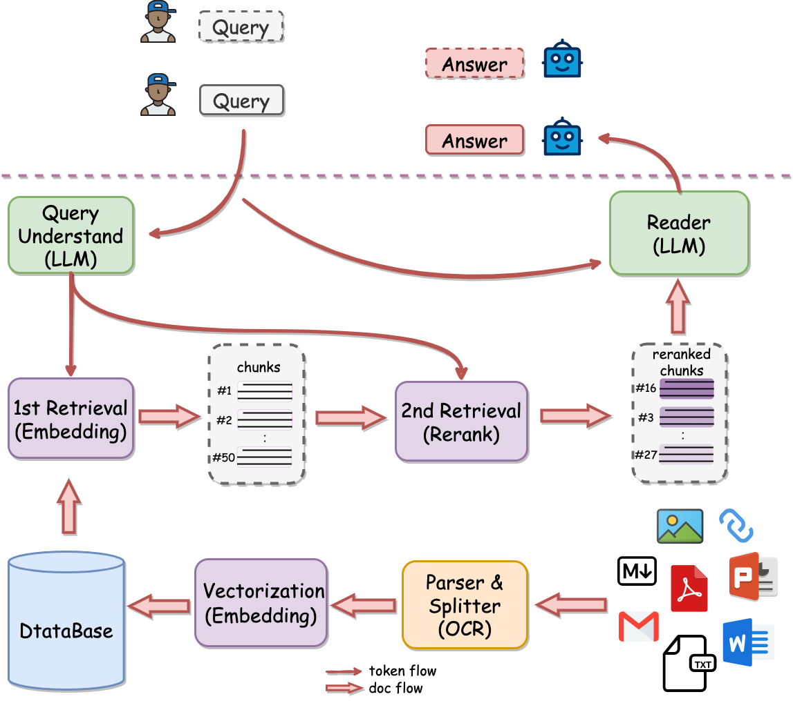

<div align="center">

  <a href="https://github.com/netease-youdao/QAnything">
    <!-- Please provide path to your logo here -->
    
  </a>

# **Q**uestion and **A**nswer based on **Anything**

<p align="center">
  <a href="./README.md">English</a> |
  <a href="./README_zh.md">简体中文</a>
</p>

</div>

<div align="center">
<br />
<a href="https://aitest.youdao.com/saas/qanything/#/home"></a>
&nbsp;&nbsp;&nbsp;&nbsp;
<a href="https://read.youdao.com#/home"></a>
&nbsp;&nbsp;&nbsp;&nbsp;

<a href="./LICENSE"></a>
&nbsp;&nbsp;&nbsp;&nbsp;
<a href=""></a>
&nbsp;&nbsp;&nbsp;&nbsp;
<a href="https://twitter.com/YDopensource"></a>
&nbsp;&nbsp;&nbsp;&nbsp;

</div>

<details open="open">
<summary>Table of Contents</summary>

- [What is QAnything?](#What-is-QAnything?)
  - [Key features](#Key-features)
  - [Architecture](#Architecture)
- [Getting Started](#getting-started)
  - [Prerequisites](#prerequisites)
  - [Installation](#installation)
- [Usage](#usage)
  - [API Document](#API-Document)
- [WeChat Group](#WeChat-Group)
- [Support](#support)
- [License](#license)
- [Acknowledgements](#Acknowledgments)

</details>

## What is QAnything?
**Q**uestion and **A**nswer based on **Anything** (`QAnything`) is a local knowledge base question-answering system designed to support a wide range of file formats and databases, allowing for offline installation and use.

With `QAnything`, you can simply drop any locally stored file of any format and receive accurate, fast, and reliable answers.

Currently supported formats include: **PDF, Word (doc/docx), PPT, Markdown, Eml, TXT, Images (jpg, png, etc.), Web links** and more formats coming soon…


### Key features

- **Data Security**, supports installation and usage with network cable unplugged throughout the process.
- **Cross-language QA support**, freely switch between Chinese and English QA, regardless of the language of the document.
- **Supports massive data QA**, two-stage vector sorting, solving the degradation problem of large-scale data retrieval; the more data, the better the performance.
- **High-performance production-grade system**, directly deployable for enterprise applications.
- **User-friendly**, no need for cumbersome configurations, one-click installation and deployment, ready to use.
- **Multi knowledge base QA** Support selecting multiple knowledge bases for Q&A

### Architecture
<div align="center">

</div>

#### 1st Retrieval（embedding）
| Model | Retrieval | STS | PairClassification | Classification | Reranking | Clustering | Avg |  
|:-------------------------------|:--------:|:--------:|:--------:|:--------:|:--------:|:--------:|:--------:|  
| bge-base-en-v1.5 | 37.14 | 55.06 | 75.45 | 59.73 | 43.05 | 37.74 | 47.20 |  
| bge-base-zh-v1.5 | 47.60 | 63.72 | 77.40 | 63.38 | 54.85 | 32.56 | 53.60 |  
| bge-large-en-v1.5 | 37.15 | 54.09 | 75.00 | 59.24 | 42.68 | 37.32 | 46.82 |  
| bge-large-zh-v1.5 | 47.54 | 64.73 | **79.14** | 64.19 | 55.88 | 33.26 | 54.21 |  
| jina-embeddings-v2-base-en | 31.58 | 54.28 | 74.84 | 58.42 | 41.16 | 34.67 | 44.29 |  
| m3e-base | 46.29 | 63.93 | 71.84 | 64.08 | 52.38 | 37.84 | 53.54 |  
| m3e-large | 34.85 | 59.74 | 67.69 | 60.07 | 48.99 | 31.62 | 46.78 |  
| ***bce-embedding-base_v1*** | **57.60** | **65.73** | 74.96 | **69.00** | **57.29** | **38.95** | ***59.43*** |  

- More evaluation details please check [Embedding Models Evaluation Summary](https://github.com/netease-youdao/BCEmbedding/blob/master/Docs/EvaluationSummary/embedding_eval_summary.md)。

#### 2nd Retrieval（rerank）
| Model | Reranking | Avg |  
|:-------------------------------|:--------:|:--------:|  
| bge-reranker-base | 57.78 | 57.78 |  
| bge-reranker-large | 59.69 | 59.69 |  
| ***bce-reranker-base_v1*** | **60.06** | ***60.06*** |  

- More evaluation details please check [Reranker Models Evaluation Summary](https://github.com/netease-youdao/BCEmbedding/blob/master/Docs/EvaluationSummary/reranker_eval_summary.md)

#### RAG Evaluations in LlamaIndex（embedding and rerank）


***NOTE:***

- In `WithoutReranker` setting, our `bce-embedding-base_v1` outperforms all the other embedding models.
- With fixing the embedding model, our `bce-reranker-base_v1` achieves the best performence.
- **The combination of `bce-embedding-base_v1` and `bce-reranker-base_v1` is SOTA**.
- If you want to use embedding and rerank separately, please refer to [BCEmbedding](https://github.com/netease-youdao/BCEmbedding)

#### LLM

The open source version of QAnything is based on QwenLM and has been fine-tuned on a large number of professional question-answering datasets. It greatly enhances the ability of question-answering.
If you need to use it for commercial purposes, please follow the license of QwenLM. For more details, please refer to: [QwenLM](https://github.com/QwenLM/Qwen)


## Getting Started

### Prerequisites

|  **Required item**     | **Minimum Requirement**   | **Note** |
| --------------         | ------------------------- | --------------------------------- |
| NVIDIA GPU Memory      |      >= 16GB              | NVIDIA 3090 recommended |
| NVIDIA Driver Version  |      >= 525.105.17        |                           |
| CUDA Version           |      >= 12.0              |                           |
| docker compose  version|      >=1.27.4             | [docker compose install](https://docs.docker.com/compose/install/)|


### Installation
* step1: pull qanything repository
```
git clone https://github.com/netease-youdao/QAnything.git
```
* step2: download the model and unzip it to the root directory of the current project.
```
cd qanything

git clone https://www.modelscope.cn/renrenren/qanything_models.git

unzip models.zip ./   # in root directory of the current project
```
* step3: start server
```
docker-compose up -d
```


## Usage
[:point_right: try QAnything online](https://aitest.youdao.com/saas/qanything/#/home)

### Cross-lingual: Multiple English paper Q&A
[](https://github.com/netease-youdao/QAnything/assets/141105427/8915277f-c136-42b8-9332-78f64bf5df22)
### Information extraction
[](https://github.com/netease-youdao/QAnything/assets/141105427/b9e3be94-183b-4143-ac49-12fa005a8a9a
)
### Various files
[](https://github.com/netease-youdao/QAnything/assets/141105427/7ede63c1-4c7f-4557-bd2c-7c51a44c8e0b)
### Web Q&A
[](https://github.com/netease-youdao/QAnything/assets/141105427/d30942f7-6dbd-4013-a4b6-82f7c2a5fbee)

### API Document
If you need to access the API, please refer to the [QAnything API documentation](docs/API.md).

## WeChat Group

Welcome to scan the QR code below and join the WeChat group.


## Support
Reach out to the maintainer at one of the following places:

- [Github issues](https://github.com/netease-youdao/QAnything/-/issues)
- Contact options listed on [this GitHub profile](https://github.com/netease-youdao)

## License

`QAnything` is licensed under [Apache 2.0 License](./LICENSE)

## Acknowledgments
`QAnything` adopts dependencies from the following:
- Thanks to our [BCEmbedding](https://github.com/netease-youdao/BCEmbedding) for the excellent embedding and rerank model. 
- Thanks to [Qwen](https://github.com/QwenLM/Qwen) for strong base language models.
- Thanks to [Triton Inference Server](https://github.com/triton-inference-server/server) for providing great open source inference serving.
- Thanks to [Langchain](https://github.com/langchain-ai/langchain) for the wonderful llm application framework. 
- Thanks to [Langchain-Chatchat](https://github.com/chatchat-space/Langchain-Chatchat) for the inspiration provided on local knowledge base Q&A.
- Thanks to [Milvus](https://github.com/milvus-io/milvus) for the excellent semantic search library.
- Thanks to [PaddleOCR](https://github.com/PaddlePaddle/PaddleOCR) for its ease-to-use OCR library.
- Thanks to [Sanic](https://github.com/sanic-org/sanic) for the powerful web service framework.

